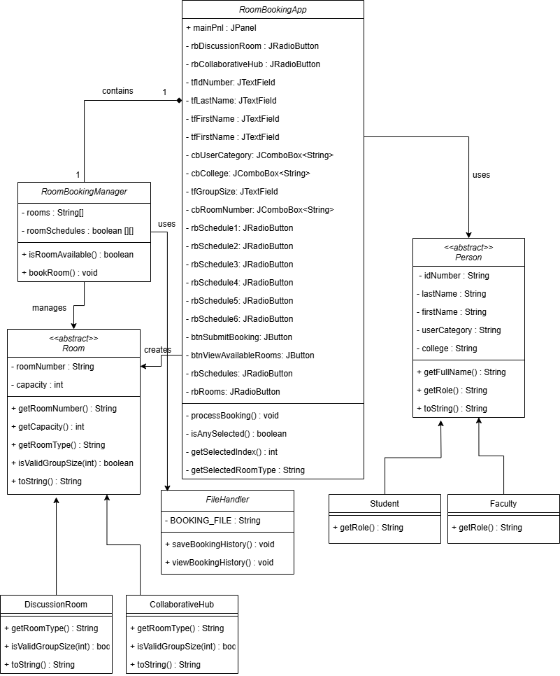
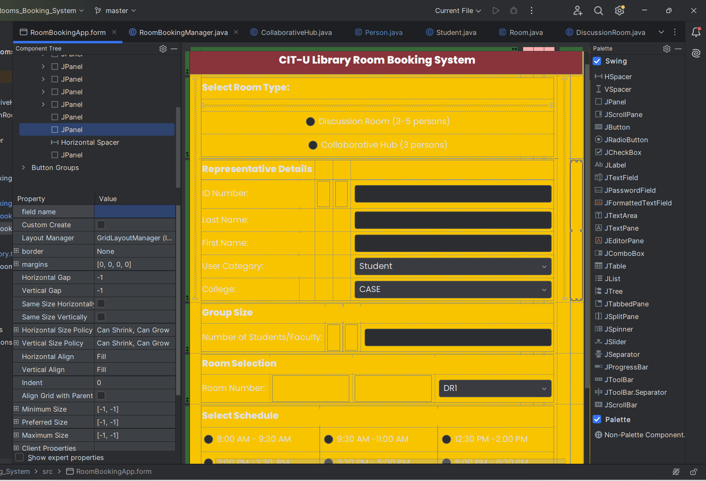
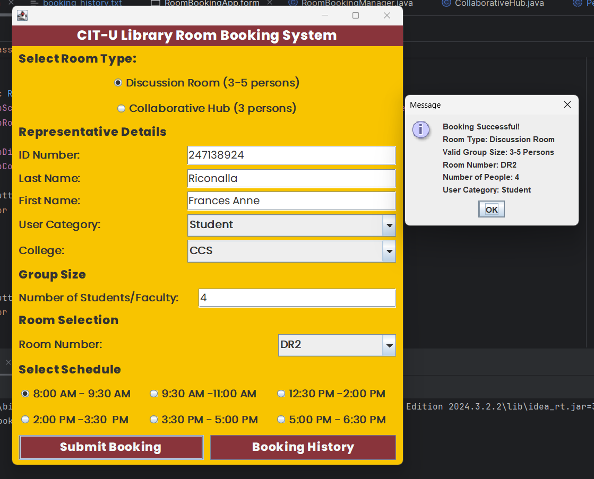
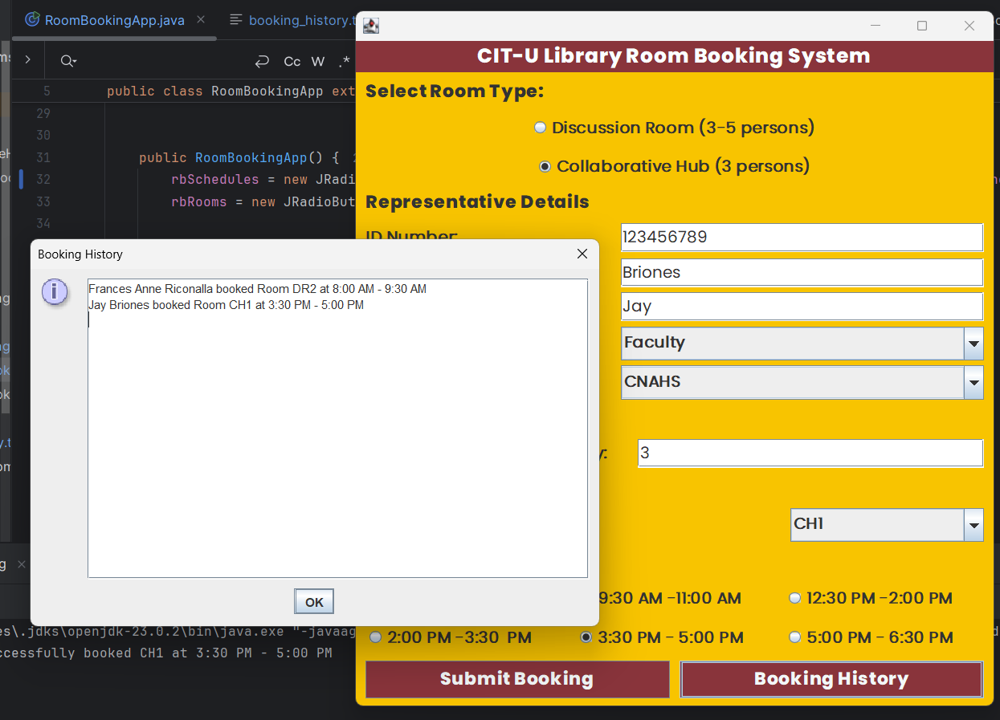
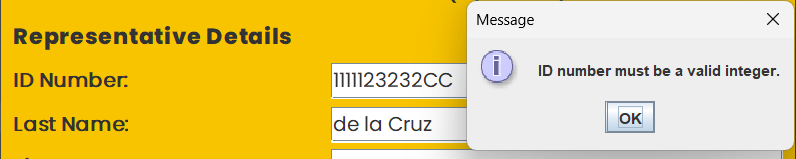
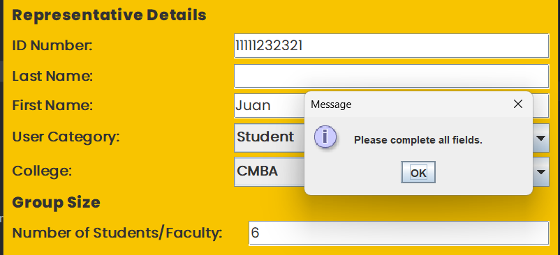
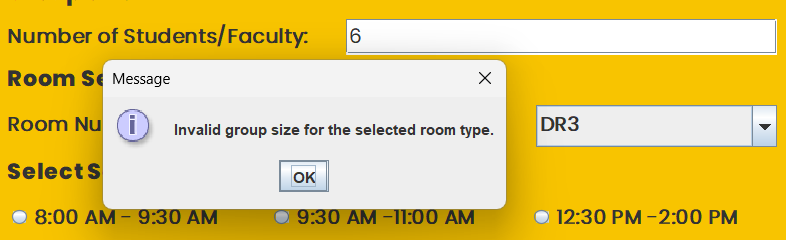
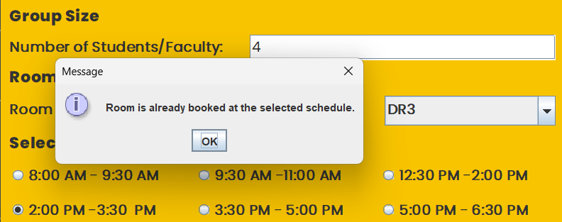

# CIT-U Library Room Booking System

### by Frances Anne Riconalla


## Description

At **CIT University**, students frequently require dedicated spaces for group study sessions, thesis discussions, or project collaborations. While the library offers five bookable rooms, the current booking process—where users scan a QR code and fill out an online form—often leads to confusion, double bookings, or unrecorded schedules. This manual approach lacks real-time validation and confirmation, making it difficult to ensure an organized and efficient booking system.

This system provides a digital solution, streamlining the room-booking process through a Java-based application with a user-friendly GUI. The library's five rooms include:

1. **3 Discussion Rooms**: Accommodates groups of 3 to 5 participants.
2. **2 Collaborative Hubs**: Designed for exactly 3 participants.

---

## Features

- **Room Selection**:
    - Users can select between **Discussion Rooms** and **Collaborative Hubs**.
    - Discussion rooms support group sizes of 3-5, while collaborative hubs allow exactly 3 participants.

- **User Categories**:
    - Supports both **Students** and **Faculty**.

- **Schedule Management**:
    - Users can choose from predefined time slots (e.g., `8:00 AM - 9:30 AM`).

- **Validation**:
    - Ensures all required fields are filled.
    - Validates group size based on the selected room type.

- **Booking History**:
    - Saves booking history in a file (`booking_history.txt`).
    - Allows viewing the booking history via a scrollable GUI.

---

## Classes and Objects (20%)

This project effectively utilizes classes and objects to model real-world entities within a library room booking system. Each class encapsulates relevant data and behavior. For instance:

- The **`Room`** class holds common properties such as `roomNumber` and `capacity`.
- The **`DiscussionRoom`** and **`CollaborativeHub`** classes enforce specific group size constraints by overriding the `isValidGroupSize()` method.
- The **`Person`** class provides shared attributes like `idNumber`, `firstName`, and `lastName`, while its subclasses **`Student`** and **`Faculty`** define role-specific features.
- The **`RoomBookingManager`** class orchestrates room availability and booking logic.
- The **`FileHandler`** class manages the file-based persistence of booking history.

By encapsulating related data and methods in specific classes, the system ensures modularity, readability, and ease of maintenance.

---
## Class Diagram (15%)
The class diagram  features a GUI (`RoomBookingApp`) built with Swing components that interacts with a `RoomBookingManager` to handle room reservations. Two class hierarchies form the core: 

(1) **Rooms**, with an abstract `Room` class extended by `DiscussionRoom` (3-5 people) and `CollaborativeHub` (3 people), which enforce group size rules; 

(2) **Users**, with an abstract `Person` class inherited by `Student` and `Faculty` roles. The `RoomBookingManager` tracks room schedules, checks availability, and collaborates with the `FileHandler` to save bookings to a text file. Relationships include inheritance (room/user types), composition (GUI owns components and manager), and dependencies (manager uses file operations). Input validation ensures valid group sizes and prevents double bookings.



---
## Four OOP Principles (35%)

### 1. Abstraction
Abstraction is demonstrated through the use of abstract classes like `Room` and `Person`. These classes encapsulate shared properties and methods while abstracting specific details that are implemented in their subclasses. For example:

```java
public abstract class Room {
    private final String roomNumber;
    private final int capacity;
    public Room(String roomNumber, int capacity) { ... }
    public abstract String getRoomType();
    public abstract boolean isValidGroupSize(int groupSize);
}
```

The `Room` class provides a template, while `DiscussionRoom` and `CollaborativeHub` implement specific behavior like group size validation.

---

### 2. Encapsulation
Encapsulation is evident in the way class fields are declared `private` and accessed via `public` getter methods. This ensures that internal data is protected from external tampering. For instance:

```java
public class Room {
    private final String roomNumber;
    private final int capacity;

    public String getRoomNumber() {
        return roomNumber;
    }

    public int getCapacity() {
        return capacity;
    }
}
```

This approach enforces controlled access to class fields, ensuring data integrity.

---

### 3. Inheritance
The system employs inheritance to reuse and extend functionality. The `DiscussionRoom` and `CollaborativeHub` classes inherit from the `Room` class:

```java
public class DiscussionRoom extends Room {
    public DiscussionRoom(String roomNumber, int capacity) {
        super(roomNumber, capacity);
    }

    @Override
    public boolean isValidGroupSize(int groupSize) {
        return groupSize >= 3 && groupSize <= 5;
    }
}
```

Similarly, `Student` and `Faculty` inherit from the `Person` class, reusing common properties like `idNumber` and `name`.

---

### 4. Polymorphism
Polymorphism is utilized through method overriding. For example, the `isValidGroupSize()` method in `Room` is overridden by `DiscussionRoom` and `CollaborativeHub` to define specific constraints:

```java
@Override
public boolean isValidGroupSize(int groupSize) {
    return groupSize == 3; // CollaborativeHub
}
```

Additionally, polymorphism allows the program to treat subclasses as their parent type, enabling dynamic behavior at runtime.

---

## Exception Handling (10%)

The program incorporates exception handling to ensure robust behavior. For example:

- **Input Validation**: The `processBooking()` method validates numeric inputs using `try-catch` blocks:

```java
try {
    int id = Integer.parseInt(tfIdNumber.getText());
} catch (NumberFormatException e) {
    JOptionPane.showMessageDialog(null, "ID number must be a valid integer.");
    return;
}
```

- **File Handling**: The `FileHandler` class uses `try-catch` blocks to handle file operations, ensuring the program remains stable even when files are missing or inaccessible:

```java
try (BufferedReader br = new BufferedReader(new FileReader(BOOKING_FILE))) {
    ...
} catch (FileNotFoundException e) {
    System.out.println("No booking history found.");
}
```

---

## File Handling (5%)

The system implements file handling through the `FileHandler` class. Bookings are saved to a file (`booking_history.txt`) using `BufferedWriter`:

```java
try (BufferedWriter bw = new BufferedWriter(new FileWriter("booking_history.txt", true))) {
    bw.write(representativeName + " booked Room " + roomNumber + " at " + scheduleTime);
    bw.newLine();
}
```

When users view the booking history, the file is read using `BufferedReader` and displayed in a scrollable GUI:

```java
try (BufferedReader br = new BufferedReader(new FileReader(BOOKING_FILE))) {
    String line;
    while ((line = br.readLine()) != null) {
        sb.append(line).append("\n");
    }
}
```

This allows persistent storage and retrieval of booking data across sessions.

---
## Graphical User Interface (15%)


The system features a user-friendly graphical user interface (GUI) designed to simplify the room reservation process for students and faculty. Built using Java Swing, the GUI allows users to select between room types (Discussion Rooms or Collaborative Hubs), specify group size, provide personal details (e.g., ID number, name, college), and choose an available time slot. Key components include radio buttons for room and schedule selection, text fields for inputting details, and combo boxes for dropdown options like user category and room numbers. Users can submit their booking or view the booking history with dedicated buttons.
When users choose to view the booking history, a scrollable pop-up window displays all past bookings saved in the `booking_history.txt` file, ensuring transparency and easy access to records.









---
**Developer's Note:** 

The implementation of the **2D arrays** in the `RoomBookingManager` class, used for managing the room schedules, and the use of the **StringBuilder** for efficient file handling were guided by AI. While designing the system, AI provided insights into using these techniques for cleaner and more scalable solutions. These suggestions significantly optimized the code and improved its overall readability and performance.

The design and functionality of the **CIT-U Library Room Booking System** GUI take inspiration from the structure and flow of an **online form used in the CIT-U Library** for reservation requests. To explore the reference form, visit [this link](https://forms.office.com/r/dAx77b0G0C?origin=QRCode).

